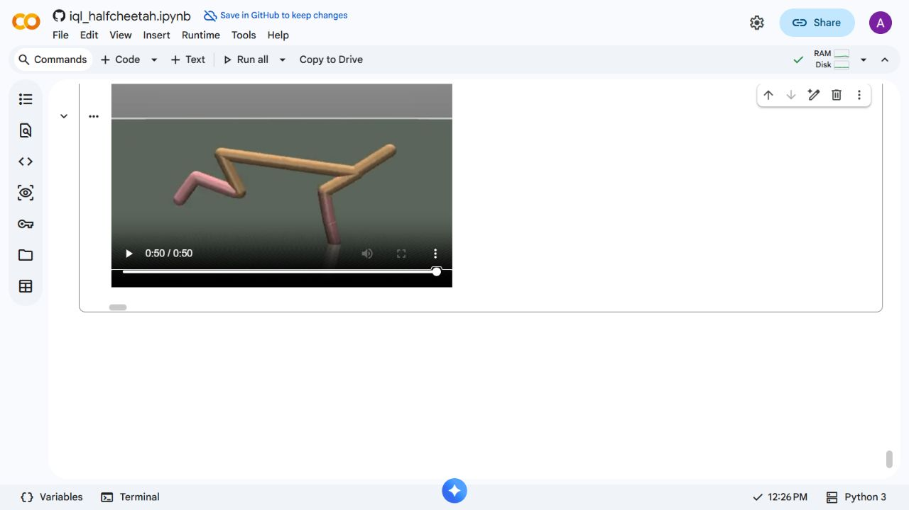

# Continuing the published IQL policies

The 100k checkpoints had weak and variable locomotion. The video recorder was
continuing real environment steps after a fall: HalfCheetah does not terminate
because it falls. The 1,000-step episode remains 50 seconds. Trimming a failed
episode or choosing a different demonstration seed would conceal this problem.

The approved experiment resumes all three published checkpoints, including
optimizer and dataset sampler state, without changing the dataset, rewards,
IQL settings, task or evaluation seeds. Training uses the frozen Windows CPU
runtime, MuJoCo 3.2.3 and PyTorch 2.7.1. Original training was on macOS; this is
a continuation experiment, not an exact reproduction of that training path.
See the [predeclared protocol](evidence/continuation/PROTOCOL.md).

## Colab measurements at 200k updates

Each mean below is ten actual 1,000-step episodes. Seeds 10000–10009 are the
validation set; 20000–20009 are the additional evaluation set. These additional
seeds were also used to inspect the 150k candidate, so they must not be described
as a never-used final test set. A stationary tail means the episode ends with
at least five seconds of absolute forward velocity at most 0.1 m/s. This is a
descriptive diagnostic, not a standard HalfCheetah success metric.

| Training seed | Validation mean, 100k → 200k | Validation stationary tails | Additional mean, 100k → 200k | Additional stationary tails |
|---|---:|---:|---:|---:|
| 0 | 2,432.17 → 8,684.36 | 7/10 → 4/10 | 1,768.83 → 5,753.86 | 7/10 → 7/10 |
| 1 | 1,634.75 → 3,832.96 | 5/10 → 8/10 | 943.85 → 2,767.34 | 9/10 → 9/10 |
| 2 | 2,496.93 → 10,698.21 | 7/10 → 3/10 | 2,300.40 → 8,386.08 | 8/10 → 5/10 |

The fixed seed-0 demonstration at 200k ran through all 50 seconds in Colab:
raw return 14,235.59, final-ten-second mean forward velocity 16.00 m/s,
zero stationary tail, and zero samples below 0.3 m torso height or inverted.
The actual recorded MP4 was decoded at 0, 10, 20, 30, 40 and 49.9 seconds.
It is 480×480, 20 fps, 50 seconds; SHA-256
`15a0717eab4a722640151b6460b1d6f114bb71cd5d6c7a9d6827d603325e1beb`.

This is an improved Colab demonstration, not reliable running across every
episode or platform. The same checkpoint's fixed Windows episode stalls for
30.1 seconds at the end, despite its ten-episode mean improving from 2,909.72
to 6,449.42. Seed 1 remains weak, and some seed-2 episodes move while inverted.

The 150k seed-0 candidate was rejected as a demo replacement: its Colab mean
improved, but the fixed video stalled for 35.45 seconds. Its successful Windows
video did not transfer to Colab. Failed candidates are retained, not hidden.

## Inspect and replay

Raw observed Colab outputs:

- [All three training seeds, baseline and 200k](evidence/continuation/colab-all-seeds-200k.json)
- [Seed 0 at 150k, including its failed fixed episode](evidence/continuation/colab-seed0-150k.json)
- [Seed 0 at 200k](evidence/continuation/colab-seed0-200k.json)

[Experimental checkpoints and the actual Colab video](https://github.com/MedvAx-AI/iql-halfcheetah/releases/tag/policy-continuation-experiment)
are published separately from the accepted original course release.
The notebook preserves the original 100k experiment, downloads the explicitly
selected checkpoint with SHA-256 verification, measures it on the current
runtime and records the same seed-10000 episode. It does not repeat the long
continuation training during Run all.

The 300k and 500k continuation stages are still running. Their outcomes are
not yet claimed here; this document and the selected checkpoint will be reviewed
after those measurements are available.
