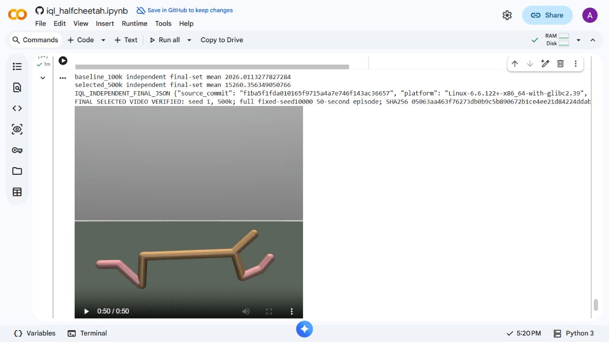
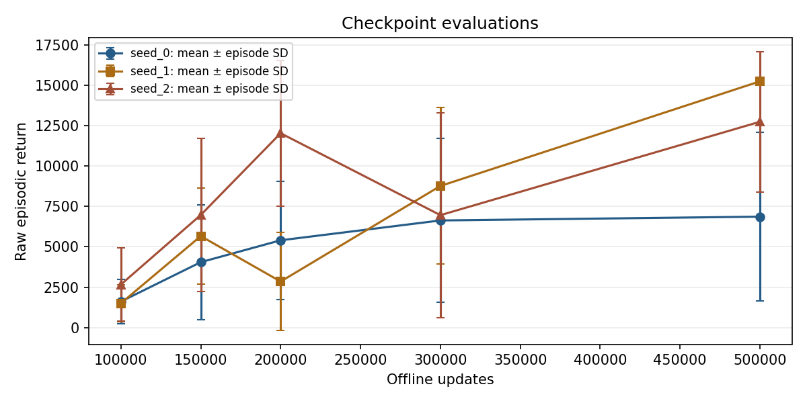
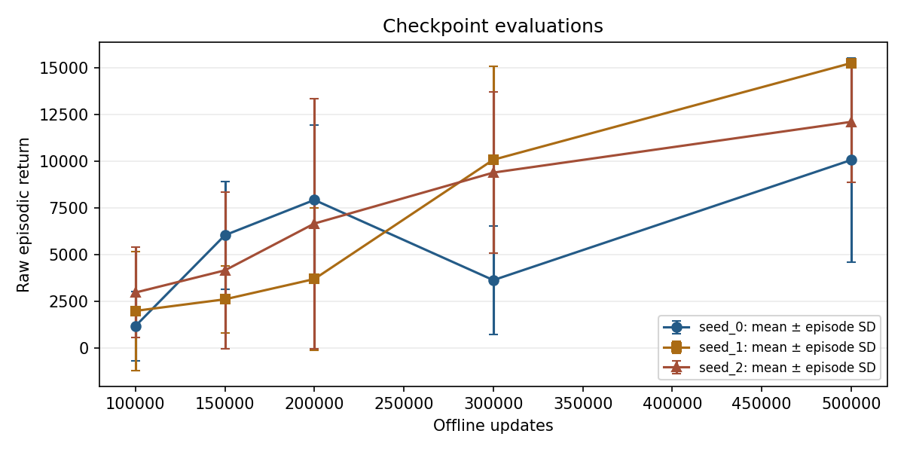

# Continuing the published IQL policies

The 100k checkpoints had weak and variable locomotion. The video recorder was
continuing real environment steps after a fall: HalfCheetah does not terminate
because it falls. The 1,000-step episode remains 50 seconds. Trimming a failed
episode or choosing a different demonstration seed would conceal this problem.

The approved experiment resumes all three published checkpoints, including
optimizer and dataset sampler state, without changing the dataset, rewards,
IQL settings, task or evaluation seeds. Training uses the frozen Windows CPU
runtime, MuJoCo 3.2.3 and PyTorch 2.7.1. Original training was on macOS; this is
a continuation experiment, not an exact reproduction of that training path.
See the [predeclared protocol](evidence/continuation/PROTOCOL.md).

## Completed 500k experiment and selected checkpoint

All three runs reached 500k. Each log contains exactly 400,000 consecutive new
updates, from 100001 through 500000, with finite metrics. Checkpoints, all staged
measurements and raw logs are retained in the
[experimental release](https://github.com/MedvAx-AI/iql-halfcheetah/releases/tag/policy-continuation-experiment).
The Windows evidence ZIP SHA-256 is
`eaefcf122e8df15f3b07d252d0e46f08e356362532b53a994cea5a6c0cddad84`.

After the initial Colab session disconnected, all five stages were evaluated
again in one reconnected session. The paired baselines below belong to that
session; they are not mixed with the earlier results further down this report.
Each mean uses ten real 1,000-step episodes, with unmodified rewards and task.

| Training seed | Colab validation mean, 100k → 500k | Validation stationary tails | Colab additional mean, 100k → 500k | Additional stationary tails |
|---|---:|---:|---:|---:|
| 0 | 1,613.03 → 6,864.09 | 9/10 → 4/10 | 1,160.43 → 10,065.53 | 6/10 → 3/10 |
| 1 | 1,504.65 → 15,232.53 | 5/10 → 0/10 | 1,974.63 → 15,262.33 | 8/10 → 0/10 |
| 2 | 2,667.16 → 12,732.22 | 8/10 → 1/10 | 2,957.79 → 12,110.87 | 8/10 → 3/10 |

Training seed **1 at 500k** is selected: it has the highest validation mean and
sustained upright movement on the predeclared demonstration seed **10000**.
Its Colab validation result is **15,232.53 ± 204.94** population episode SD;
the additional-set result is **15,262.33 ± 124.63**. All 20 episodes have zero
low-torso/inverted samples and no long stationary tail. The fixed demo return
is 15,312.45, with final-ten-second mean forward velocity 16.65 m/s and zero
stationary tail. The selection is recorded in [publication.json](evidence/continuation/publication.json).

The actual Colab MP4 was recorded for the full 50 seconds at 480×480, 20 fps,
decoded at 0, 10, 20, 30, 40 and 49.9 seconds, and inspected at the final frame.
Its SHA-256 is
`05063aa463f76273db0b9c5b890672b1ce4ee21d84224ddab1fe7ec31a09e7eb`.
[Watch the retained full episode](https://github.com/MedvAx-AI/iql-halfcheetah/releases/download/policy-continuation-experiment/colab_seed_1_500k_demo_seed_10000.mp4).

The checkpoint was selected before inspecting a new final set, seeds
**30000–30009**. Their mean improves from **2,026.01** for the paired seed-1
100k baseline to **15,260.36** at 500k. The baseline has 10/10 long stationary
tails; the selected policy has 0/10, with zero low-torso/inverted samples.
[All independent final-test episodes](evidence/continuation/independent-final-test.json)
are retained. No checkpoint was reselected using this set.

Windows measurements are separate: seed 1's validation mean improves from
2,488.94 to 15,246.29; additional mean from 1,839.43 to 15,246.32, with zero long
stationary tails in those 20 continued-policy episodes. Its fixed Windows demo
also has sustained late movement and zero low-torso samples. See
[raw Windows diagnostics and log hashes](evidence/continuation/windows-summary.json).
The stationary-tail threshold is descriptive, not a benchmark success score.
These finite samples do not guarantee upright running for every seed/platform;
seeds 0 and 2 still have failures at 500k.

## Corrected figures

The original screenshot's means and error bars were mathematically correct.
It contained only a 100k checkpoint, so it was a snapshot, not a learning curve.
Single-checkpoint plots now separate training seeds and show every episode.

The final reference curves below use all measured 100k, 150k, 200k, 300k and 500k
checkpoints in one Colab session. Each point is ten episodes for one training
seed, with population episode SD. Lines connect measured points; no intermediate
scores are inferred. Across-run summaries separately use sample SD of three
run means. Neither spread is a confidence interval. The additional set was reused
during selection and is not an untouched final test set.

Raw [validation CSV and summaries](evidence/continuation/validation/summary.json),
[additional summaries](evidence/continuation/additional/summary.json), input hashes
and [curve-rebuild script](evidence/continuation/summarize_colab.py) are retained.
The notebook labels these recorded reference curves separately from its newly
measured current-runtime replay.

## Earlier Colab session: 200k measurements

Each mean below is ten actual 1,000-step episodes. Seeds 10000–10009 are the
validation set; 20000–20009 are the additional evaluation set. These additional
seeds were also used to inspect the 150k candidate, so they must not be described
as a never-used final test set. A stationary tail means the episode ends with
at least five seconds of absolute forward velocity at most 0.1 m/s. This is a
descriptive diagnostic, not a standard HalfCheetah success metric.

| Training seed | Validation mean, 100k → 200k | Validation stationary tails | Additional mean, 100k → 200k | Additional stationary tails |
|---|---:|---:|---:|---:|
| 0 | 2,432.17 → 8,684.36 | 7/10 → 4/10 | 1,768.83 → 5,753.86 | 7/10 → 7/10 |
| 1 | 1,634.75 → 3,832.96 | 5/10 → 8/10 | 943.85 → 2,767.34 | 9/10 → 9/10 |
| 2 | 2,496.93 → 10,698.21 | 7/10 → 3/10 | 2,300.40 → 8,386.08 | 8/10 → 5/10 |

The fixed seed-0 demonstration at 200k ran through all 50 seconds in Colab:
raw return 14,235.59, final-ten-second mean forward velocity 16.00 m/s,
zero stationary tail, and zero samples below 0.3 m torso height or inverted.
The actual recorded MP4 was decoded at 0, 10, 20, 30, 40 and 49.9 seconds.
It is 480×480, 20 fps, 50 seconds; SHA-256
`15a0717eab4a722640151b6460b1d6f114bb71cd5d6c7a9d6827d603325e1beb`.

This is an improved Colab demonstration, not reliable running across every
episode or platform. The same checkpoint's fixed Windows episode stalls for
30.1 seconds at the end, despite its ten-episode mean improving from 2,909.72
to 6,449.42. Seed 1 remains weak, and some seed-2 episodes move while inverted.

The 150k seed-0 candidate was rejected as a demo replacement: its Colab mean
improved, but the fixed video stalled for 35.45 seconds. Its successful Windows
video did not transfer to Colab. Failed candidates are retained, not hidden.

## Earlier Colab session: 300k measurements

The same validation and additional sets were measured again; they are reused
evaluation sets, not new independent final tests.

| Training seed | Validation mean | Validation stationary tails | Additional mean | Additional stationary tails | Fixed seed-10000 episode |
|---|---:|---:|---:|---:|---|
| 0 | 5,099.65 | 5/10 | 6,191.24 | 1/10 | Stalls for the final 36.05 seconds |
| 1 | 8,890.81 | 4/10 | 7,223.93 | 4/10 | Upright through 50 seconds; return 13,526.53 |
| 2 | 9,315.28 | 1/10 | 10,163.19 | 1/10 | Mostly inverted; return 764.65 |

For seed 1's fixed episode, final-ten-second mean forward velocity is 15.25 m/s,
with zero stationary tail, low-torso samples or inverted samples. Its actual
480×480, 20-fps, 50-second video was recorded and decoded at six timestamps;
SHA-256 `2a0cc6a7551229b0fe1b6960f4e863919b924bcde3e745397829b97005448f4f`.
Seed 0's 300k checkpoint is rejected as a demo replacement. Seed 2 shows why
forward motion or a high mean return alone cannot establish upright running.

The initial continued-policy notebook selected seed 0 at 200k and completed
all **12 code cells with zero errors** in
[Linux CI 37913375267](https://github.com/MedvAx-AI/iql-halfcheetah/actions/runs/37913375267).
The full real-data suite passed **98 tests**; the 20 continued-policy validation
records repeated exactly. CI ran a synthetic PR merge commit
`9100f5468259d10671d78c2e97d87311625a61bb`, not the earlier Colab source SHA.
Its seed-0 200k means were 5,403.12 (validation) and 7,922.81 (additional),
showing that other Linux CPUs can also differ from the recorded Colab results.
The [raw CI acceptance output](evidence/continuation/pr16-ci-acceptance.json)
is labeled separately from the frontend evidence.

## Inspect and replay

Raw observed Colab outputs:

- [Final session: all three seeds at 150k](evidence/continuation/colab-all-seeds-150k.json)
- [Final session: all three seeds at 200k](evidence/continuation/colab-all-seeds-200k.json)
- [Final session: all three seeds at 300k](evidence/continuation/colab-all-seeds-300k.json)
- [Final session: all three seeds at 500k](evidence/continuation/colab-all-seeds-500k.json)
- [Earlier session: all three seeds at 200k](evidence/continuation/prior-session/colab-all-seeds-200k.json)
- [Seed 0 at 150k, including its failed fixed episode](evidence/continuation/colab-seed0-150k.json)
- [Seed 0 at 200k](evidence/continuation/colab-seed0-200k.json)
- [Earlier session: all three seeds at 300k](evidence/continuation/prior-session/colab-all-seeds-300k.json)

[Experimental checkpoints and the actual Colab video](https://github.com/MedvAx-AI/iql-halfcheetah/releases/tag/policy-continuation-experiment)
are published separately from the accepted original course release.
The notebook preserves the original 100k experiment, downloads the explicitly
selected checkpoint with SHA-256 verification, measures it on the current
runtime and records the same seed-10000 episode. It does not repeat the long
continuation training during Run all.

All three 500k runs and the final-session evaluations are complete. The selected
checkpoint improves the measured fall/stall behavior without trimming episodes,
changing rewards or substituting a favorable demonstration seed. The original
course artifacts and unsuccessful candidates remain available for comparison.
