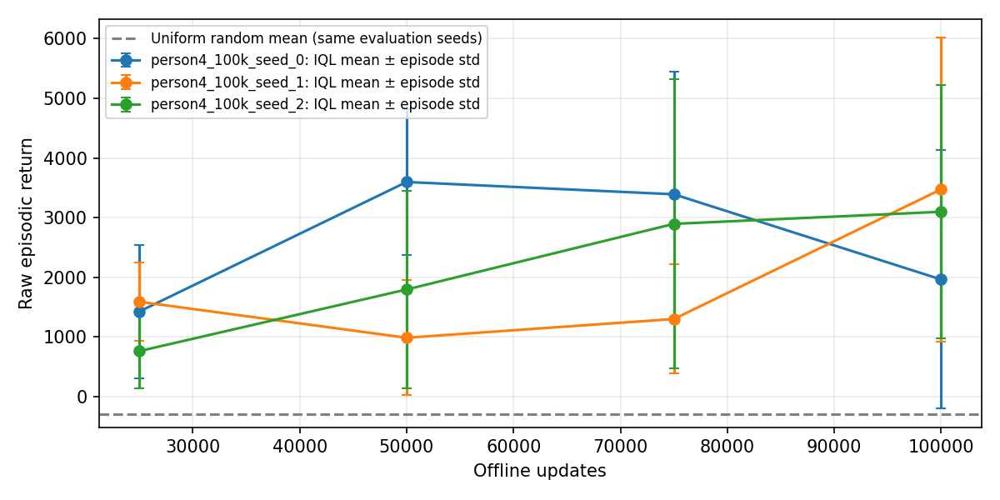

# Person 4 — measured results and handoff

Implements the local deliverables for [issue #3](https://github.com/MedvAx-AI/iql-halfcheetah/issues/3).
Source baseline: `c11578b720e1c2bbf64382f51580541dcb8c5328` plus the local implementation changes
fingerprinted in [experiment_report.json](experiment_report.json). The report explicitly
records the dirty working tree; it does not represent these edits as already merged.
The implementation was subsequently pushed in commit
[`8a8c1d4`](https://github.com/MedvAx-AI/iql-halfcheetah/commit/8a8c1d41f5a62ba1f8ab7dfe926b8758b57c29c2).

## Measured result

Each of training seeds **0, 1, 2** completed **100,000 offline updates**, batch size 256,
with the shared hyperparameters and `checkpoint_interval=25000`. Every checkpoint
at 25k/50k/75k/100k used the same ten evaluation seeds **10000–10009**. The recovered
HalfCheetah-v5 horizon is 1,000 steps; every recorded episode lasted 1,000 steps.
Observation mean/std came from each checkpoint, and returns use raw environment rewards.

| Training seed | Final mean return | Episode std (population) | Episodes |
|---|---:|---:|---:|
| 0 | 1964.28 | 2164.35 | 10 |
| 1 | 3475.73 | 2548.32 | 10 |
| 2 | 3099.20 | 2128.01 | 10 |

The uniform random baseline was **−287.40 ± 56.68** (episode population std).
Its ten raw returns and lengths match across all three run directories because
its RNG is deliberately reseeded per evaluation seed.

Across the three final run means: **2846.41 ± 786.80**
(sample std between training seeds). This is separate from the episode variation
in the table. All three runs are present at every plotted checkpoint.

IQL's final average is above the random baseline, with substantial episode variation.
Learning is not monotonic: seed 0 averaged 3598.90 at 50k, then 1964.28 at 100k.
The final checkpoints were selected by the fixed update budget, and video seed 10000
was fixed in advance. We did not select the best checkpoint or the best episode.
These are 100k-update results; the default 500k-update schedule was not run.
No D4RL normalized score, confidence interval, or performance threshold is claimed.

**Video assessment: robust running has not been demonstrated.** All three fixed-seed
demo episodes show a fall or stall. Seed 0 is stationary for the last **40.7 seconds**;
seed 1 for **35.9 seconds**. Seed 2 has an inverted torso during **93.1%** of sampled
steps. These are descriptive diagnostics for seed 10000, not a standard benchmark
score or a claim about all evaluation episodes. Definitions and measurements are in
[demo_diagnostics.json](demo_diagnostics.json). Positive average return above a random
baseline is insufficient evidence of stable locomotion.



Training loss plots: [seed 0](training_seed_0.png), [seed 1](training_seed_1.png),
[seed 2](training_seed_2.png). Consecutive blocks of 100 updates are averaged for
plotting; the complete update-indexed JSONL files are retained in the local artifacts.

## Evidence and local artifacts

- [Raw CSV](evaluation.csv): 120 IQL episodes plus 30 repeated-baseline rows.
- [Summary JSON](summary.json): within-run and across-run statistics at four checkpoints.
- [Experiment report](experiment_report.json): config, preprocessing provenance, source
  hashes, versions, hardware, elapsed time, checkpoint/video hashes and verified checks.
- Local run artifacts: `results/person4_100k_seed_{0,1,2}/`, matching checkpoint
  directories, and `videos/person4_100k_seed_{0,1,2}/demo_seed_10000.mp4`.

All three MP4s decode at the start and end: 480×480, 20 fps, 50 seconds. The selected
video episode's corresponding evaluation return is retained in the CSV, including
when it is lower than the run mean. No video or checkpoint bytes are committed.

Published videos with the ground visible throughout:
[seed 0](https://github.com/MedvAx-AI/iql-halfcheetah/releases/download/person4-evaluation-100k/person4_100k_seed_0_visible_floor_demo_seed_10000.mp4),
[seed 1](https://github.com/MedvAx-AI/iql-halfcheetah/releases/download/person4-evaluation-100k/person4_100k_seed_1_visible_floor_demo_seed_10000.mp4),
[seed 2](https://github.com/MedvAx-AI/iql-halfcheetah/releases/download/person4-evaluation-100k/person4_100k_seed_2_visible_floor_demo_seed_10000.mp4).
URLs and SHA-256 are in [publication.json](publication.json) and the
[video index](../../../videos/README.md). Each asset was downloaded without credentials,
matched byte-for-byte by SHA-256 and decoded at its first and last frames.

The default XML floor has an infinite collision plane but a finite ±40 m drawing.
Beyond that rectangle, a grounded agent appears suspended over a grey background.
Recording now sets the plane's drawing extents to zero (infinite). Every repeated
episode return and length matches the original CSV exactly; a 1,000-step physics
comparison beyond the visible rectangle also matches exactly. The camera and
physical task are unchanged. This repair does not improve the policy. See
[MuJoCo's plane definition](https://mujoco.readthedocs.io/en/3.2.3/XMLreference.html#body-geom).
HalfCheetah does not terminate on a fall, so all 1,000 steps remain visible, per the
[environment definition](https://gymnasium.farama.org/environments/mujoco/half_cheetah/#episode-end).

[Download the original experiment archive](https://github.com/MedvAx-AI/iql-halfcheetah/releases/download/person4-evaluation-100k/person4_artifacts.tar.gz)
with all twelve checkpoints, logs, CSVs, plots, manifests and original MP4s.
[bundle_manifest.json](bundle_manifest.json) records its SHA-256 and contents.
The archive preserves the experiment snapshot before these publication/rendering
updates; use the branch for the current source and the linked assets for corrected
renderings.

Hardware: **Apple M3 Pro, 36 GiB RAM**, macOS/arm64, CPU PyTorch 2.7.1, one PyTorch thread.
Python 3.11.16; NumPy 2.2.6; Gymnasium 1.2.2; MuJoCo 3.2.3; Minari 0.5.3; MoviePy 2.2.1.
Logged training times were **322.08, 326.20 and 329.65 seconds**, excluding download,
dataset loading, evaluation and encoding. Runtime/platform details are in the report.
The dataset's HDF5 SHA-256 matches the verified official source bytes.

## Reproduction and verification

See [the evaluation guide](../../EVALUATION.md) for all CLI/API and artifact contracts.
From the repository root after `uv sync --frozen --extra dev --extra notebook`:

```bash
export MINARI_DATASETS_PATH="$PWD/data/minari"
uv run --frozen python scripts/run_experiments.py \
  --steps 100000 --checkpoint-every 25000 --run-prefix person4_100k --video --download
uv run --frozen iql-project summarize \
  --run-dirs results/person4_100k_seed_0 results/person4_100k_seed_1 results/person4_100k_seed_2 \
  --run-dir results/person4_100k_aggregate
IQL_RUN_REAL_DATA=1 uv run --frozen pytest -q
uv run --frozen ruff check .
uv run --frozen ruff format --check .
uv run --frozen python scripts/check_environment.py
uv run --frozen python scripts/check_notebook.py
uv pip check
uv export --frozen --all-extras --no-emit-project --no-hashes --no-header -o /tmp/iql-requirements.txt
diff requirements.lock.txt /tmp/iql-requirements.txt
UV_OFFLINE=1 uv run --frozen python -m build --installer uv
```

Use a fresh run prefix to protect existing runs. The actual local invocations used
the locked `.venv/bin/python`; the commands above use the same locked environment.
`UV_OFFLINE=1` assumes build dependencies have already been cached.

At the original experiment export, **86 tests passed**, including the optional real-data training test;
lint, format, environment reset/ten steps, notebook schema/empty-output check,
dependency/export parity and isolated wheel/sdist build passed. Seed 0 was evaluated
again with the final evaluator: all 40 IQL returns/lengths and ten baseline episodes
matched exactly. Manifest artifact checksums, every finite training metric, consecutive
updates and start/end video decoding were checked before exporting the evidence.

The notebook is checked in with no outputs. All nine code cells at implementation
commit `8a8c1d4` executed in a fresh local Python 3.11.16 kernel, including measured curves and embedded MP4; the
executed copy is ignored under `results/person4_notebook_execution.ipynb`.
This is a local check, and clean Colab acceptance remains with the lead/Person 5.

After publication and the floor-rendering repair, **87 tests passed**, including
the real-data test and the added 1,000-step physics comparison. Lint/format,
environment and notebook checks passed. The updated demo cell was executed for
both the local embedded MP4 and the public URL fallback. Downloads/checksums,
video decoding and report/publication/diagnostic consistency were also verified.
These later checks and current source hashes are recorded separately under
`post_experiment_validation` in the report; the original experiment hashes remain
the historical source fingerprint.

## Failed attempts and recovery

The first experiment process aborted with exit 134 while rendering the final seed-0
video inside the Codex macOS sandbox. Training and metrics were retained. Retrying
recording with host graphics access succeeded using the saved 100k checkpoint.
Seeds 1 and 2 then ran through the same public `train`/`evaluate_checkpoint` APIs;
their videos were recorded separately with host graphics access. No training seed
was discarded or retrained to improve its score.

A replay invocation omitted `MINARI_DATASETS_PATH` and could not access the default
cache. Setting the existing repository-local cache fixed it; the failure and retry
are retained in the seed-0 manifest. The first sandboxed notebook attempt could not
bind its local kernel sockets, and a subsequent local-kernel run succeeded. A build
refresh could not resolve PyPI inside the sandbox; the cached offline isolated build
succeeded. These were execution-environment failures, and do not represent divergent
training runs.

## Remaining integration gates

The code and evidence are pushed on `feature/evaluation`, and the artifact release
is published with verified download URLs and checksums. A PR with lead review,
remote CI acceptance and final clean Colab acceptance remain integration gates.
The implementation preserves shared signatures and updates the notebook's affected
evaluation/demo cells. Policy performance still needs improvement and a fresh
evaluation; the present demos must not be presented as successful stable running.
